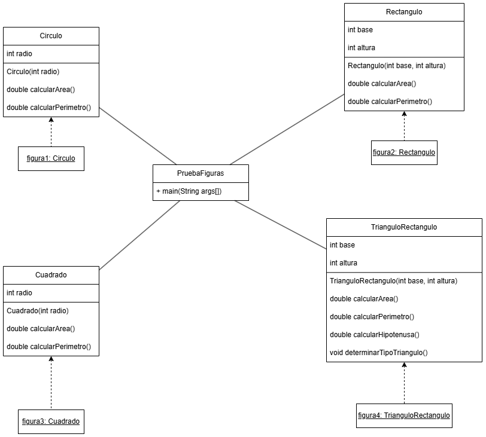

# Actividades POO 2024-2S
En este repositorio se guardarán los códigos de las actividades propuestas por el profesor Arboleda Mazo Walter Hugo para el curso Programación Orientada a Objetos, semestre 2024-2S.

Cada rama del repositorio representa una actividad propuesta por el profesor, dentro de cada rama estarán los códigos de los ejercicios propuestos, cada uno en un archivo diferente.

# Diagrama Parte 2

# Integrantes
El grupo está conformado por:
- Estefanía Mazo Uribe. emazou@unal.edu.co
- Juan Diego Castro Marín. jucastroma@unal.edu.co
